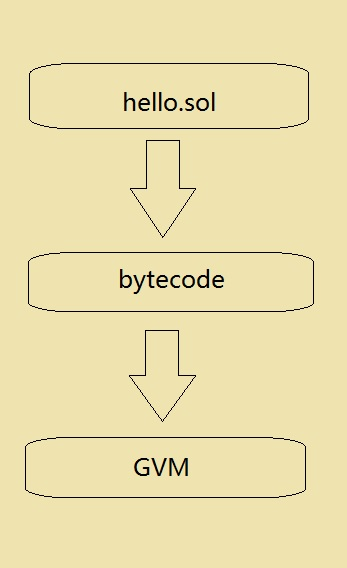

# GVM虚拟机

## 虚拟机介绍
GSC虚拟机(GVM)是一个完全独立的沙盒，合约代码可以对外完全隔离并在GVM内部运行。由于GVM分散储存在各个节点上的计算机上，所以希望创建智能合约的开发者可以使用JS或Python等编程语言创建运行在GVM
   上的应用程序。GVM的设计目标是构建具有简单性、确定性、容易优化、节省空间、确保安全等属性且专用于区块链的系统。应用开发者可以基于高级程序语言Solidity进行开发智能合约。
## 运作原理
GSC底层通过GVM模块支持合约的执行与调用，调用时根据合约地址获取到代码，生成环境后载入到GVM中运行。通常智能合约的开发流程是用solidlity编写逻辑代码，再通过编译器编译元数据，最后再发布到GSC上。如下图:
 

