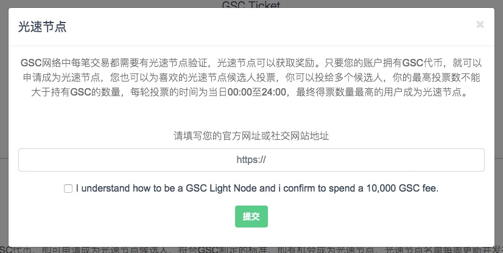
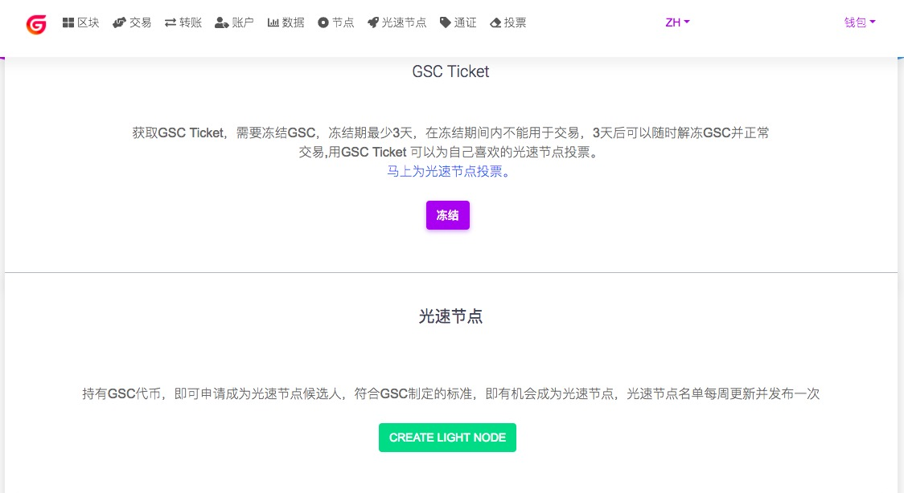
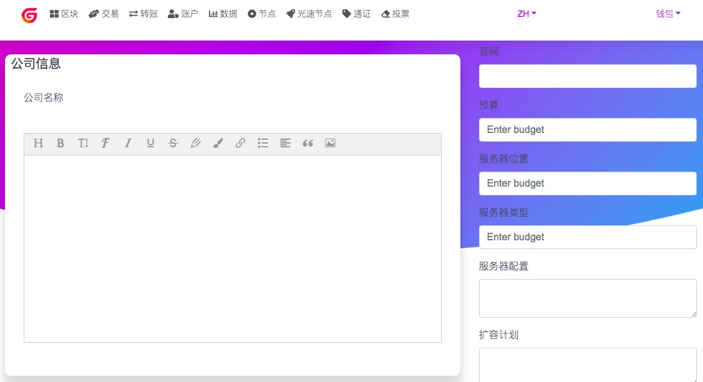

# 光速节点操作指南

光速节点是GSC 的共识机制采用 ADPOS（Account-Delegated Proof-of-Stake），由被社区选举的可信帐户（受托人，得票数排行前23位）来创建区块，光速节点指的是在 GSC 网络中收集交易信息并打包到区块里的节点，也称作“区块生产者（Block Producers, BPs）”，其特点是出块时间短，效率较高，节点是构建GSC网络的基础，上述23个可信账户即为 GSC 光速节点（同时有 50 个备用节点），由它们产生GSC网络的所有区块记录。也就是说，之所以GSC要竞选光速节点，正是由ADPOS共识机制决定的。

### 1.申请成为光速节点候选人
注册钱包账户后，在钱包账户页面，点击“申请成为光速节点候选人”

填写官方网址或社交网址，申请候选人会消耗您账户中的10000个GSC

### 2.创建光速节点官方信息
申请成功后，原来的“申请成为光速节点候选人”按钮，变更为“创建光速节点”按钮。光速节点候选人需要提交自己的节点官方信息

点击“创建光速节点”按钮，进入到创建官方信息页面

按照页面提示如实填写自己的官方信息说明： 
光速节点名称：光速节点的名称
光速节点描述：简单介绍官方参与竞选的介绍
公司名称：参与光速节点竞选的公司介绍
公司介绍：简单介绍公司的信息
锁仓地址：公布官方持有GSC资产的地址
社交网址：填写官方的Facebook、Twitter、电报群等账号
硬件配置：填写投入预算、硬件配置等信息，展示官方竞选实力
官方宣传：填写官方团队、社群、直播等团队介绍及市场宣传计划，展示官方竞选实力

### 3.为光速节点候选人投票
光速节点候选人提交官方信息后，可以在投票页面列表展示

投票需要消耗GSC Ticket，投票前需要冻结账户中的GSC来获得GSC Ticket
点击投票按钮

发动自己的粉丝来为自己投票吧！
