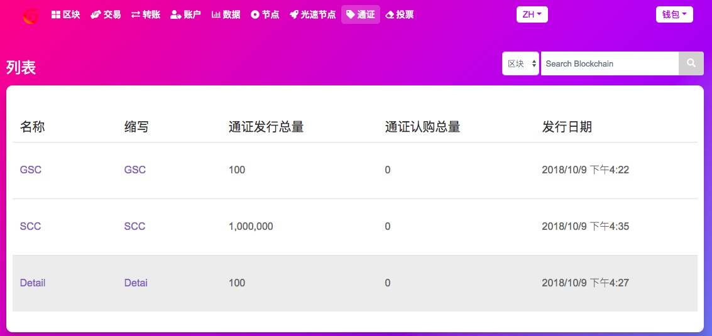
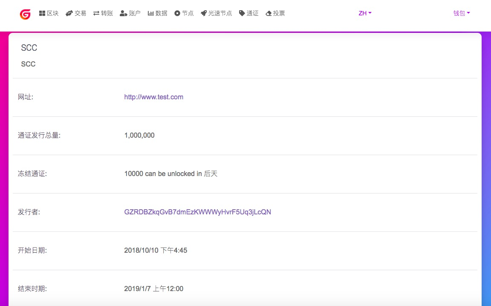
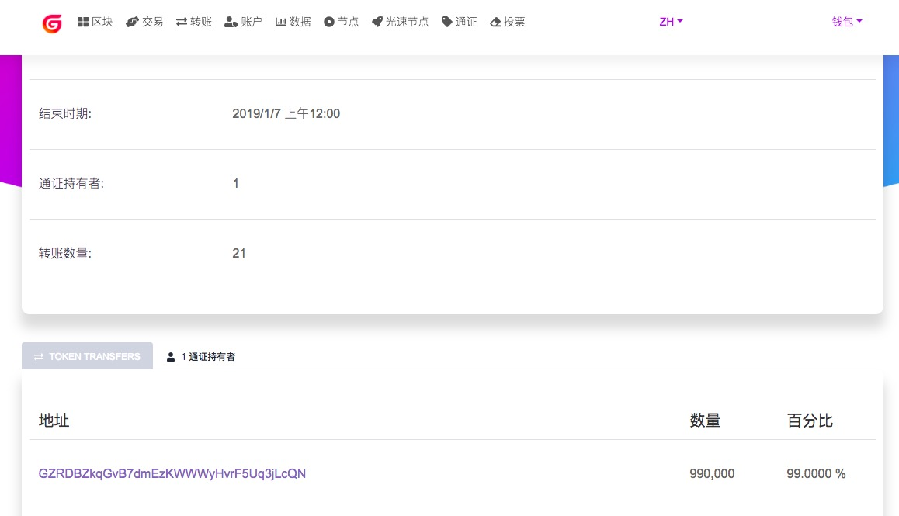
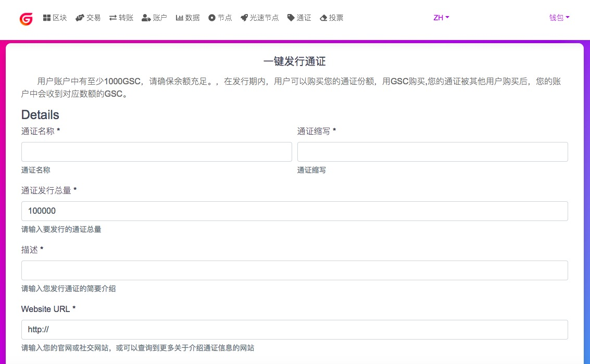
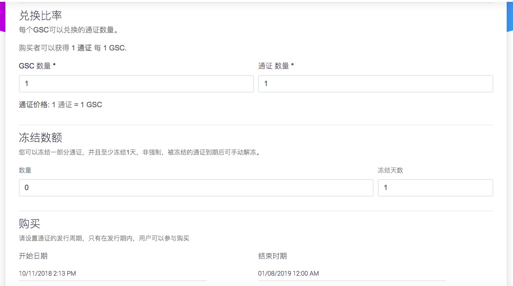
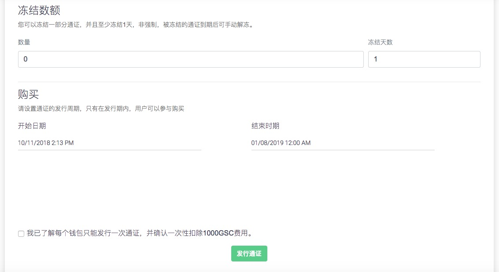

# GSC Explorer Token操作指南

注册钱包账户后，可以发行自己的GSC Token，也可以参与购买别人发行的GSC Token
发行GSC Token会消耗1000个GSC

## 参与购买GSC Token

打开Token 列表，可以查看所有已发行的GSC Token

点击Token的名称，可以进入详情页查看该Token的详细信息

选择想要参与的Token，点击参与购买，输入数量，购买成功后，按照汇率，您的账户中会扣除相应的GSC，同时增加对应的GSC Token的数量

购买的GSC Token也可以与别的GSC钱包进行转入转出交易

## 发行GSC Token
您可以发行自己的GSC Token，每个钱包账户只能发行一次，发行Token会消耗1000个GSC
打开Token，点击发行
填写发行Token的基础信息：名称、缩写、发行总量、描述、网址等

设置GSC Token与GSC的兑换比率、冻结金额及冻结期限，设置发行的周期（在发行期内才可以参与购买，发行期结束后自动结束开放购买）

勾选此项，发行Token会消耗您账户中的1000个GSC，点击确认，发行成功后的Token稍后会在Token列表中展示。

