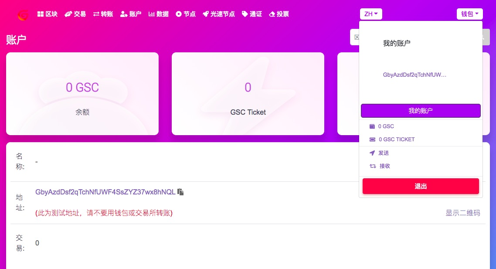

# GSC Explorer 内置钱包
创建钱包需要设置高强度密码

GSC不会保存钱包私钥，无法通过系统找回，自己一定要妥善保存和备份

使用私钥才可以登录钱包

登录钱包后，可以使用钱包管理账户资产、给光速节点投票、发行个人数字资产等

## 创建钱包
在右上角选择创建钱包，即可开始

密码用来保护私钥，设置高强度密码

一定要保护好私钥和密钥文件，GSC不会保存您的密码，如果忘记无法找回

## 登录钱包
每次登录可使用私钥登录，如果私钥丢失可以使用密钥文件导入钱包

## 钱包账户
进入到钱包账户，可以查看和管理自己的GSC资产

使用浏览器内置钱包可以给其他GSC钱包转入转出GSC资产

可以冻结账户中的GSC，为光速节点投票

用户也申请成为光速节点候选人，成为光速节点候选人需要消耗10000个GSC

# GSC Explorer操作指南

GSC Explorer是GSC公链的对外信息查询窗口，使用GSC Explorer可以查询GSC公链的任何一笔交易以及区块、地址的信息。

作为普通用户，可以使用区块链浏览器内置钱包，通过冻结GSC为喜欢的光速节点投票也可以申请成为光速节点。

作为光速节点，可以发布自己的官方信息，获得用户的投票，通过打包GSC网络的交易记账获得出块奖励

每个用户都可以一键发行自己的数字资产，也可以参与购买别人发行的数字资产。

## 区块查询

可查询实时的出块列表

可按区块id查询详细信息

## 交易查询

可查看实时的交易列表

可按交易id查看详细信息

## 转账查询

可查看实时的转账列表

可按转账交易id查看详细信息

## 账户查询

可查询GSC持仓账户的列表

可按账户地址查看详细信息

## 数据查询

查看GSC的成交、价格、持仓排行等各种数据统计

